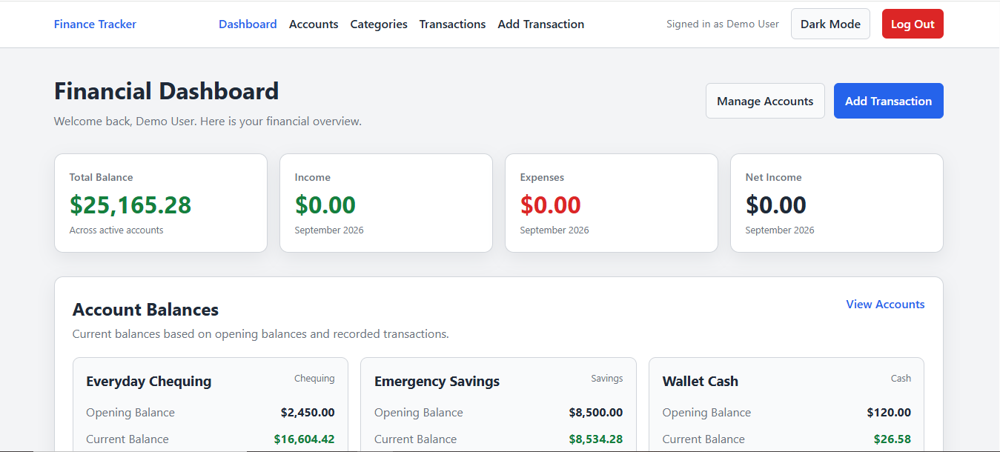
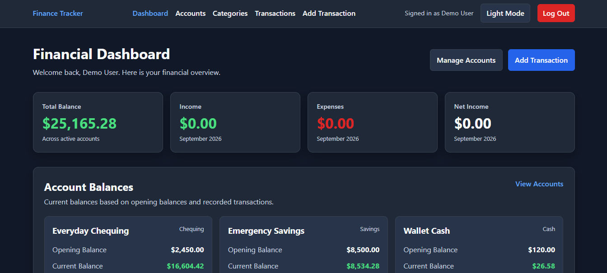
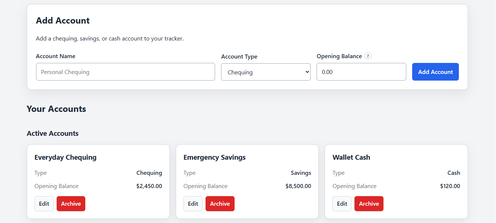
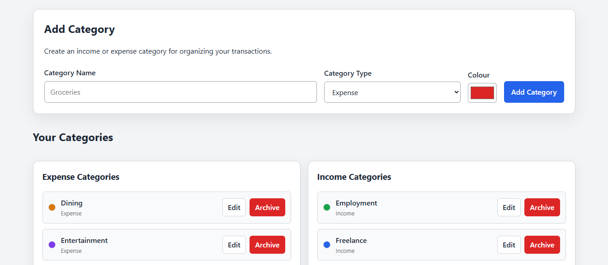
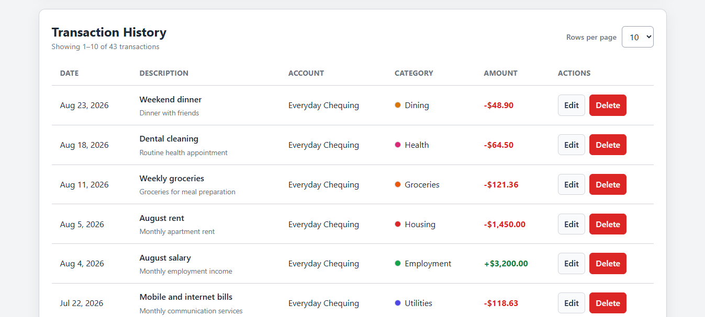
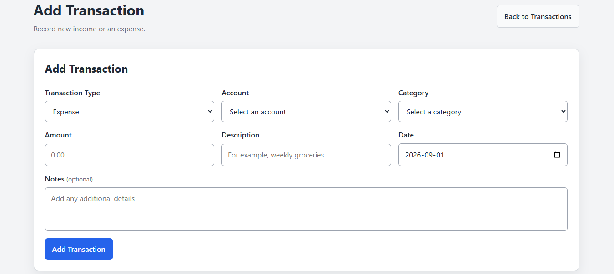

# Personal Finance Tracker

A full-stack personal finance application for organizing accounts, categories, income, and expenses. Users can securely create an account, record financial activity, review account balances, and explore transaction history through searching, filtering, sorting, and pagination.

This project was built as a portfolio application to demonstrate full-stack JavaScript development with React, Express, PostgreSQL, authentication, relational database design, and responsive user-interface development.

## Features

### Authentication

- User registration and login
- Password hashing with Argon2id
- PostgreSQL-backed login sessions
- Protected application routes
- Persistent authentication after page refresh
- Secure logout
- User-specific financial data

### Dashboard

- Financial overview for the authenticated user
- Account balance summaries
- Income and expense summaries
- Recent financial activity
- Links to frequently used application features

### Account management

- Create chequing, savings, and cash accounts
- Set an opening balance
- Review calculated account balances
- Edit account details
- Archive and restore accounts
- Preserve historical transactions for archived accounts

### Category management

- Create separate income and expense categories
- Assign custom category colours
- Edit category details
- Archive and restore categories
- Preserve historical transactions for archived categories

### Transaction management

- Record income and expense transactions
- Select an account and matching category
- Add an amount, description, date, and optional notes
- Edit existing transactions
- Delete transactions
- View account and category information in transaction history
- Display archived labels for historical records

### Transaction discovery

- Search descriptions and notes
- Filter by transaction type
- Filter by account
- Filter by category
- Filter by date range
- Sort by date, amount, or description
- Navigate paginated results
- Select the number of transactions displayed per page

### Interface

- Responsive layouts for desktop and mobile screens
- Light and dark themes
- Accessible form labels and status messages
- Keyboard-visible focus styles
- Reduced-motion support
- Dynamic site footer

## Technology Stack

### Frontend

- React
- Vite
- React Router
- JavaScript
- HTML
- CSS
- React Context
- Fetch API
- ESLint

### Backend

- Node.js
- Express
- express-session
- connect-pg-simple
- express-validator
- Argon2
- CORS
- dotenv

### Database

- PostgreSQL
- node-postgres (`pg`)
- Relational foreign-key constraints
- Database indexes
- PostgreSQL-backed session storage

### Development and deployment

- Git and GitHub
- Postman
- pgAdmin 4
- Neon PostgreSQL
- Render Web Services
- Render Static Sites

## Screenshots

### Financial Dashboard



### Dark Theme



### Account Management



### Category Management



### Transaction History



### Add Transaction



## Project Structure

```text
personal-finance-tracker/
├── client/
│   ├── public/
│   ├── src/
│   │   ├── components/
│   │   │   ├── auth/
│   │   │   ├── layout/
│   │   │   ├── theme/
│   │   │   └── transactions/
│   │   ├── config/
│   │   ├── context/
│   │   ├── hooks/
│   │   ├── pages/
│   │   ├── utils/
│   │   ├── App.jsx
│   │   ├── index.css
│   │   └── main.jsx
│   ├── .env.example
│   ├── package.json
│   └── vite.config.js
├── docs/
│   └── screenshots/
├── server/
│   ├── config/
│   ├── controllers/
│   ├── db/
│   │   ├── index.js
│   │   ├── schema.sql
│   │   └── seed.sql
│   ├── middleware/
│   ├── routes/
│   ├── validators/
│   ├── .env.example
│   ├── package.json
│   └── server.js
├── .gitignore
├── PROJECT_PLAN.md
└── README.md
```

## Local Installation

### Prerequisites

Install the following before running the project:

- Node.js 22.12 or later
- npm
- PostgreSQL
- Git

### Clone the repository

```bash
git clone https://github.com/YOUR-USERNAME/personal-finance-tracker.git
cd personal-finance-tracker
```

Replace `YOUR-USERNAME` with the GitHub username that owns the repository.

### Install the server dependencies

```bash
cd server
npm install
```

### Install the client dependencies

```bash
cd ../client
npm install
```

## Environment Variables

The repository contains example environment files for both applications. Real environment files are excluded from Git.

### Server environment

Create:

```text
server/.env
```

Use `server/.env.example` as a starting point:

```dotenv
PORT=3000

DB_USER=postgres
DB_HOST=localhost
DB_NAME=personal_finance_tracker
DB_PASSWORD=replace_with_your_password
DB_PORT=5432

DATABASE_URL=

NODE_ENV=development
CLIENT_URL=http://localhost:5173
SESSION_SECRET=replace_with_a_long_random_secret
```

The individual `DB_*` variables are intended for local PostgreSQL development.

`DATABASE_URL` is available for hosted PostgreSQL environments such as Neon. When `DATABASE_URL` is provided, the server uses the complete connection string instead of the individual local connection values.

Use a long, unpredictable value for `SESSION_SECRET`. Never commit a real database password, connection string, or session secret.

### Client environment

Create:

```text
client/.env
```

Use `client/.env.example` as a starting point:

```dotenv
VITE_API_URL=http://localhost:3000
```

In production, `VITE_API_URL` should contain the deployed Express API address.

## Database Setup

Create a local PostgreSQL database:

```text
personal_finance_tracker
```

Run the schema contained in:

```text
server/db/schema.sql
```

The schema creates:

- `users`
- `accounts`
- `categories`
- `transactions`
- `user_sessions`
- Foreign-key constraints
- Data-validation constraints
- Database indexes

The schema can be executed through pgAdmin 4's Query Tool or with PostgreSQL's `psql` command-line utility.

Example:

```bash
psql -d personal_finance_tracker -f server/db/schema.sql
```

Adjust the PostgreSQL connection options if your local configuration requires a username, host, or port.

## Optional Development Seed

An optional demonstration dataset is available at:

```text
server/db/seed.sql
```

> [!WARNING]
> The seed script removes all existing users, sessions, accounts, categories, and transactions before inserting the demonstration data. Use it only with a local development database that can be safely erased. Do not run it against a production database.

The seed creates:

- One populated demonstration user
- Chequing, savings, and cash accounts
- Active and archived accounts
- Income and expense categories
- Active and archived categories
- More than 40 transactions
- Data suitable for testing searching, filtering, sorting, pagination, and historical records

Demo credentials:

```text
Email: demo@example.com
Password: FinanceDemo2026!
```

Run the seed through pgAdmin 4's Query Tool or with:

```bash
psql -d personal_finance_tracker -f server/db/seed.sql
```

The seed is repeatable. Running it again resets the development data and recreates the same demonstration dataset.

## Running the Application

Run the backend and frontend in separate terminals.

### Start the Express server

From the `server` directory:

```bash
npm run dev
```

The API will be available at:

```text
http://localhost:3000
```

The database health endpoint is:

```text
http://localhost:3000/api/health
```

### Start the React client

From the `client` directory:

```bash
npm run dev
```

The frontend will normally be available at:

```text
http://localhost:5173
```

Open the frontend address in a browser and either register a new account or use the optional seeded demo credentials.

## API Summary

The Express API is organized into the following route groups:

| Route group         | Purpose                                                                                           |
| ------------------- | ------------------------------------------------------------------------------------------------- |
| `/api/auth`         | Registration, login, logout, and current-user authentication                                      |
| `/api/accounts`     | Account creation, retrieval, editing, archiving, and restoration                                  |
| `/api/categories`   | Category creation, retrieval, editing, archiving, and restoration                                 |
| `/api/dashboard`    | Authenticated financial summaries and recent activity                                             |
| `/api/transactions` | Transaction creation, retrieval, editing, deletion, filtering, sorting, searching, and pagination |
| `/api/health`       | Application and database connectivity check                                                       |

Protected API routes require an authenticated session.

## Testing

The application has been tested through:

- Postman API requests
- Browser-based user-interface testing
- PostgreSQL constraint testing
- Authentication and authorization checks
- Client and server validation tests
- Responsive viewport testing
- Light and dark theme testing
- React Router direct-navigation and refresh testing
- ESLint
- Vite production builds

Run the frontend checks from the `client` directory:

```bash
npm run lint
npm run build
```

Postman was used to verify successful requests and expected failure responses, including authentication failures, invalid input, missing fields, ownership restrictions, filters, sorting, searching, and pagination.

## Deployment Status

Deployment is currently in progress.

The production application will use:

- Render Static Site for the React frontend
- Render Web Service for the Express API
- Neon PostgreSQL for the production database

The production Neon database will use `schema.sql` without the destructive development seed.

Live application and API links will be added after deployment.

## Future Improvements

Possible future enhancements include:

- Monthly category budgets
- Recurring transactions
- CSV transaction exports
- Additional dashboard charts
- Automated integration tests
- Password change and account-recovery workflows
- Email verification
- User profile settings
- Custom reporting periods
- Improved public demonstration mode

## License

This project is licensed under the [MIT License](LICENSE).

## Author

Created by Mathieu Smuk as a full-stack web development portfolio project.
